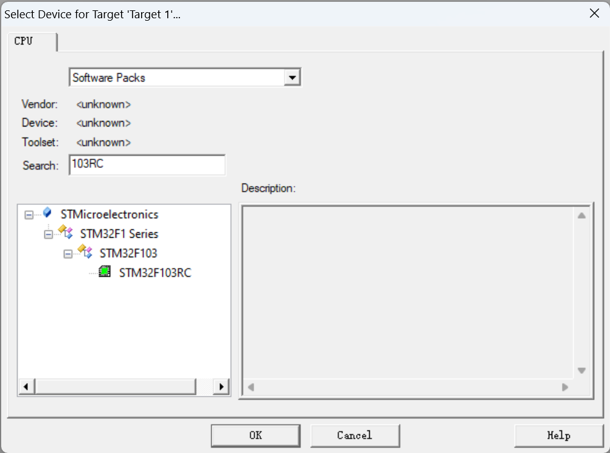
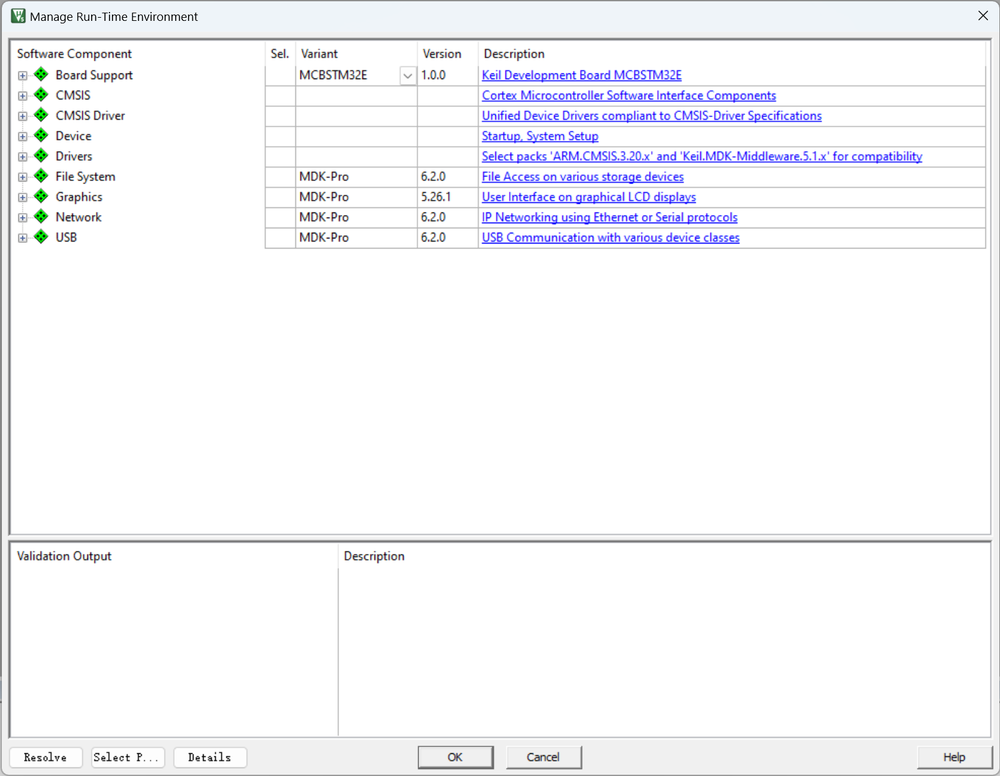
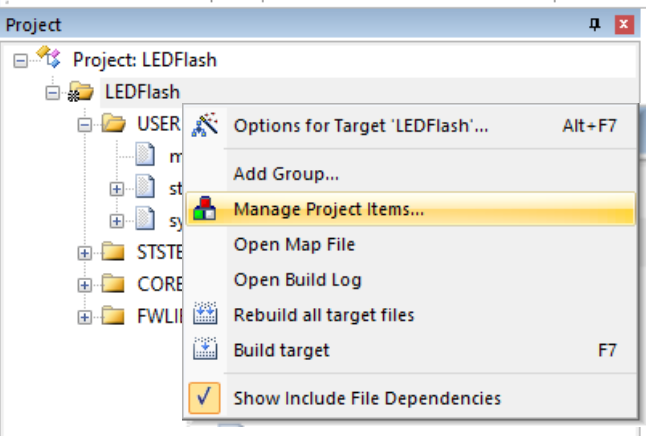
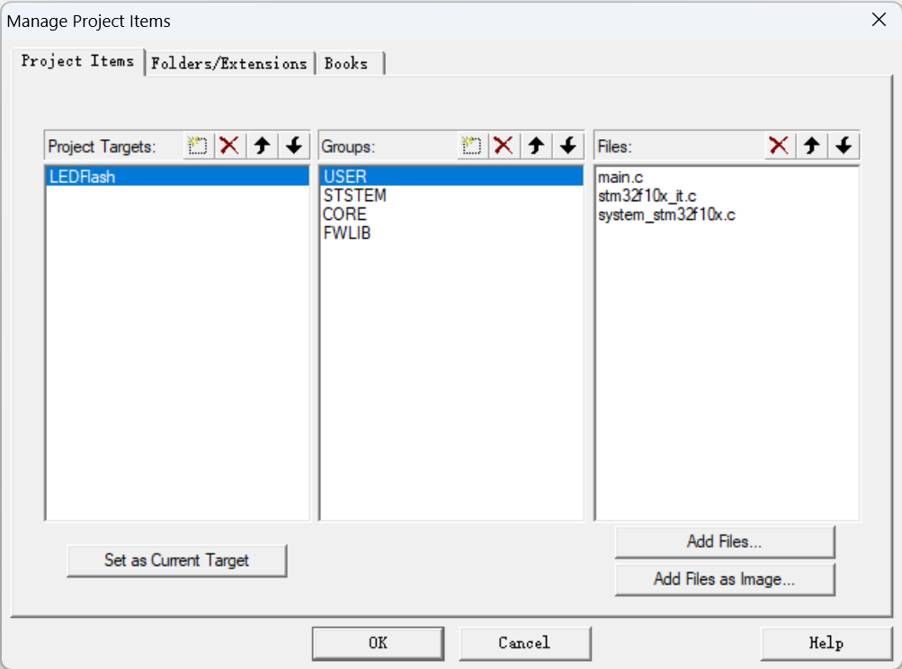
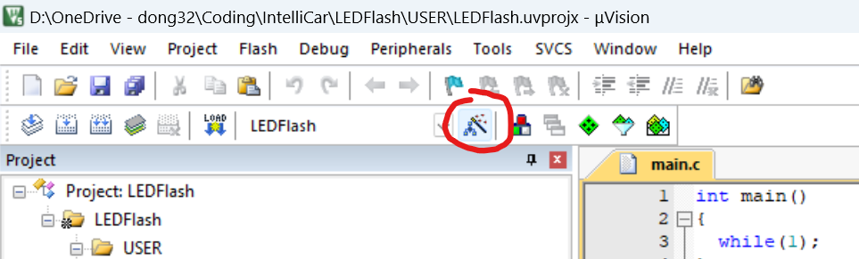
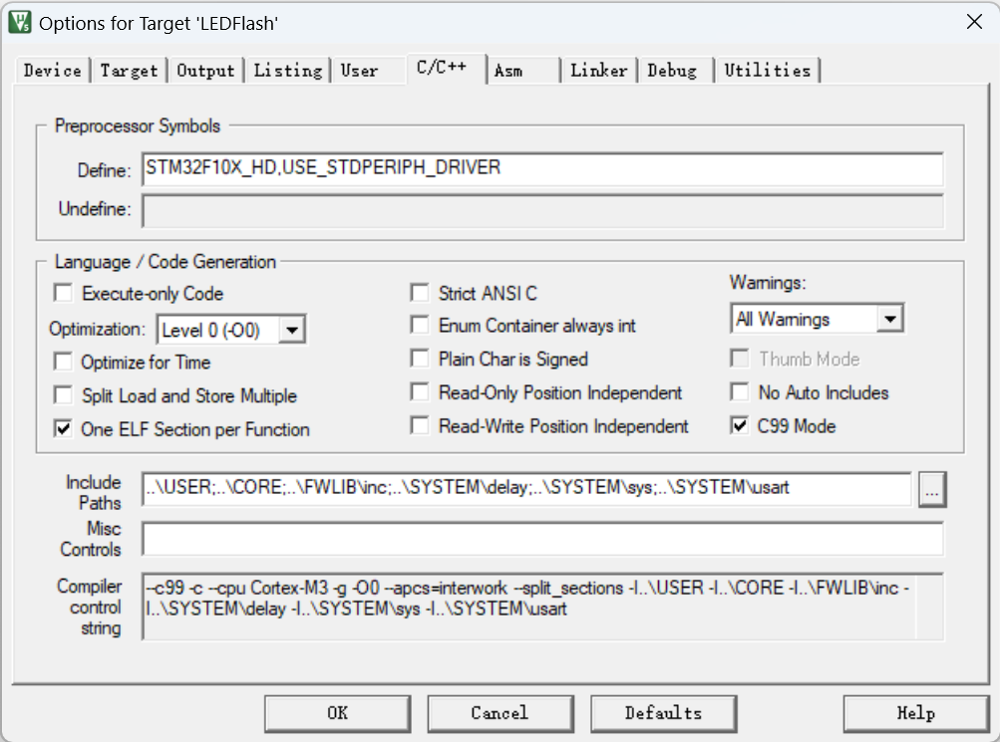
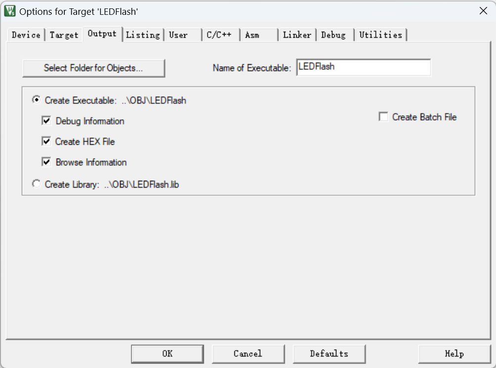

# Keil 新建项目指南

## 创建文件结构

1. 将项目文件夹模板中的文件夹全部复制到项目目录下

## 使用Keil新建STM32F103RC项目

1. 进入Keil

2. 在顶部菜单栏选中`Project` $\to$ `new uVersion Project`

3. 在弹出的窗口中选择对应芯片

   

4. 在下一个界面中选择cancel

   

5. 随后双击重命名Target

6. 右键进入管理项目菜单

   

7. 在下面的界面中添加组和文件

   

   添加的文件都应为 `.c` 和 `.s` 文件

8. 至此新建项目部分完成，接下来进入配置项目编译设置环节

## 配置项目编译设置

1. 点击下图中红圈所示按钮

   

2. 配置C/C++编译选项

   

   * Define栏填入

     ```
     STM32F10X_HD,USE_STDPERIPH_DRIVER
     ```

   * 可选择性勾选`C99 Mode` 

   * 将所有含有 `.h` 头文件的文件夹都添加到`Include Paths`

3. 配置输出选项

   

   * 勾选 `Create HEX File`
   * 点击 `Select Folder Objects` 按钮，将输出路径设置为`OBJ`文件夹
   * 如有必要可修改 `Name of Executable` 导出文件名

4. 配置完成